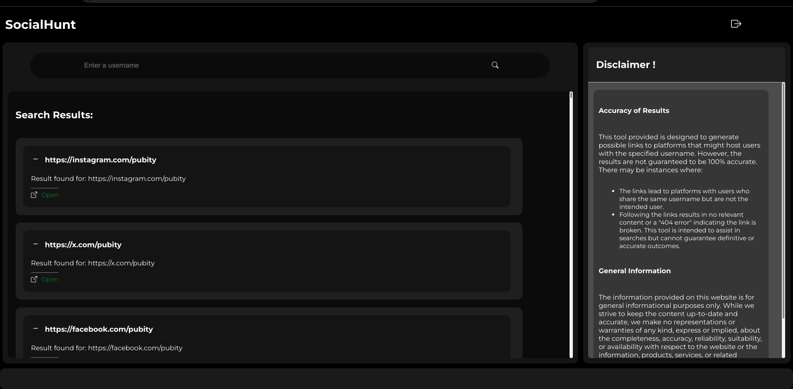

# Social Hunt

**Social Hunt** is a simple and user-friendly recon web application, similar to Sherlock that helps users locate social media accounts or other web profiles associated with specific usernames across multiple platforms. It uses Django for the backend and supports efficient and intuitive search functionality.

---

## Features

- **User Registration and Login**: Secure user authentication using Django's built-in authentication system.
- **Search Functionality**: Allows users to search for usernames across various platforms, generating possible links.
- **Result Handling**: Displays links to potential user profiles and indicates if no results are found.
- **Responsive Design**: Provides an intuitive and mobile-friendly user interface.

---

## Disclaimer

1. **Search Result Accuracy**: The results generated by Social Hunt are not guaranteed to be 100% accurate. The tool provides possible links that may lead to sites with users having the same username. Some links may result in a 404 error or broken links, and there might be cases where no results are found.
2. **Responsible Usage**: This tool is intended for ethical and legitimate purposes. Misuse of the platform for malicious activities is strictly prohibited.
3. **Platform Availability**: The accuracy and availability of results depend on the external platforms being queried and are subject to their terms of service and API limitations.

---

## Screenshots

### Login Page

### Search Page

---

---

## License

Social Hunt is licensed under the MIT License. See the LICENSE file for more details.

---

